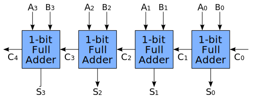

# 컴퓨팅 원리 및 패러다임

## 1주차 겸 개요

```
제 이름은 김철민 이고요, 사범대학 컴퓨터교육과에서 학생들을 가르치고 있습니다.

이번 시간에는 컴퓨팅에 대한 얘기, 요즘 4차 산업이다 인공지능 등을 얘기하는데 도데체 컴퓨팅이 뭔가, 그것들이 어떻게 우리가 사는 세상에 영향을 주는가 정확하게 이해를 해야 우리들에게 유리하게 사용할 수 있고, 컴퓨팅의 여러가지 사물을 얘기하고자 합니다.

프로그래밍을 전문가 수준으로 한다는 건 아니에요, 교양이니까. 도움이 필요하면 언제든지 면담 요청 하셔도 됩니다.

오늘은 컴퓨팅의 본질적인 부분을 잠시 소개할려고 해요. 컴퓨팅이라는 분야가 보통은 기술적인 분야로 이해를 하는데, 사실 컴퓨팅이라는 분야가 여러 이름으로 불리고 있어요. IT로 불리기도 하고, 정보통신, 정보과학, 컴퓨터 과학 등 여러가지 용어로 불리다 보니까 이런 부분들이 어떤 시각으로 붙여진 이릉인지 전체적인 경계도 잡기 어렵습니다.

많은 사람이 컴퓨팅에 대해 오해를 하고 있어요. "아, 저 사람은 컴퓨터를 잘 다루니까 컴퓨터 전문가다." 이렇게 말하는데 그건 기능적인 거고 기술적인 건 아니에요. 실질적으로 컴퓨팅에 대한 본질은 아는 사람은 그렇게 많지 않다고 생각을 해요. 사실 컴퓨터를 전공한 사람도 컴퓨팅에 대해 잘 모르고 단지 주어진 대로 공부하고 그 기반의 기술을 쌓고 있는게 아닌가.. 저는 이런 생각을 하고 있어요.

컴퓨팅이라는 분야를 조금 더 이해했으면 좋겠는데, 컴퓨팅은 실제로 하나의 학문 분야입니다. 보통 학문이라 하면 탐구하고 관심을 보이는 분야라고 해요. 모든 학문이 주된 탐구 대상이 있습니다. 그 학문의 이름은 추정하기 쉬운 이름으로 잡는 편이에요. 예를 들어 물리학이면 "아, 물리적인 세계, 물리적인 현상을 대상으로 해서 그 및바닥을 들여다 보는 학문이구나" ... 사회학, 교육학 등등

근데 이 컴퓨팅 쪽은 워낙 이름이 다양합니다.

그중에 그나마 컴퓨팅의 선도적인 역할을 하는 국가는 대부분 영어권입니다. 수준 높은, 앞서있는 연구 자료도 이쪽에서 많이 나와요. 그래서 컴퓨팅의 대표적인 분야 중에 하나가 컴퓨터 과학입니다. 또 다른 말로 정보과학, 인포 매트릭스, 컴퓨터 공학라고 해요. 학문의 이름만 놓고 보면 뭐가 주 탐구 대상이라고 드냐면 "아, 컴퓨터 과학은 컴퓨터를 다루는 학문이구나" "정보 과학은 정보를 주로 다르는 학문이구나" 라고 오해하기 쉬워요. 그게 많은 착각들을 불러 일으킵니다. 컴퓨터를 만들고 컴퓨터를 활용하고, 컴퓨터가 주인공이 되서 그 중심에서 일어나는 일을 탐구하는 학문인가? 이런 식의 생각을 하기 쉽게 되어 있는데, 이름이 잘못 지어졌다는 거에요. 왜 이름이 잘못 지어졌느냐, 초창기 학문이 태동할때 기껏해야 1940년대? 아니면 주판이나 초보적인 기계를 시작으로 보면 (파스칼의 계산기라던지..) 100년 남짓으로 볼 수도 있어요. 전기/전자적으로 작동되는 컴퓨터는 1040년대부터 나오기 시작했는데, 그때는 어찌보면 컴퓨터 라는 학문이 없었어요. 컴퓨터가 이런 일을 해주니까 컴퓨터를 작동시켜서 계산을 했어요.. 당시 주로 전쟁에 많이 활동되었죠. 40년대면 2차대전이잖아요? 독일군의 암호를 해독하거나(앨런 튜링), 탄도 미사일을 계산하는 기술적인 걸로 시작을 해서, 학문적인 기본 틀 없이 응용이 먼저 시작된거죠. 그렇게 하다보니까 그 당시엔 컴퓨터가 중심이었어요. 그래서 한 나라에 그런 컴퓨터가 몇톤 정도 되는 규모에 한두센터 정도 되는 정도로 있었어요. 시간이 점점 지나면서 이론이 정립이 되다 보니까 "컴퓨터 과학" 이라는 이름이 나온지 모르겠네요. 컴퓨팅 분야 만큼 급속하게 발전하는, 사회에 큰 영향을 주는 분야는 찾기 힘들어요. 거의 처음이라는 과언에 어울릴 정도입니다.

컴퓨팅이 어떤 특성을 가지고 어떤 힘이 있었기에 그렇게 되었는가, 우리가 살펴봐야 합니다.

아무튼 지금도 계속 발전하고 있어요. 그러다 보니 시대에 따라 불리는 이름이 다른데.. 그 명칭에 따라 어떤 부분이 부각되었요. 그러다 보니 사람마다 컴퓨팅에 대해 다양한 관점을 가지게 되었고, 컴퓨팅의 실체에 대해 오늘 제대로 들여다보는게 맞아요.

여기 컴퓨터 교육과 학생도 있지만, 제가 이 과목을 교양으로 하는 이유는 컴퓨터 전공하는 사람도 컴퓨팅에 대해 잘 모르고, 비전공자는 더군다나 말할 것도 없고 (물론 개인의 관심이 있어서 깊이 있게 한 사람도 있겠지만) 대부분의 경우는 잘 몰라요. 이 분야에 대한 이름이 다양하지만, 저는 앞으로 '컴퓨팅' 이라고 부를려고 해요.

Compute 라고 하는 단어가 뭐와 비슷하냐면 Calculate 와 비슷해요. 둘다 '계산하다' 라는 뜻이죠. 근데 주로 Calculus 라고 하면 미적분학, 수학 얘기를 많이 합니다. 실수나 아날로그 대상으로 할때 쓰는 말이에요. 공학용 계산기는 Calcualtor 입니다. '계산하다' 라는 뜻입니다. 계산하다라는 의미를 이해할려면 '계산'의 의미를 명확히 이해애야 되요. 컴퓨터 라는 말이 어디서 나왔어요? 보통 er 이나 or 을 붙이면 그 동사에 대한 활동을 하는 주체, 그게 사람일 수도 있고, 기기일 수도 있겠죠? 컴퓨터라고 하면 계산의 주체에요. 사람이라고 하면 계산자, 계산 수행자 라고 할수 있는 의미이고, 아니면 기계라고 생각하면 계산기 라고 의미를 갖는 컴퓨터에요. 어쨌든 컴퓨팅에 대한 의미를 잘 모르면 컴퓨터도 오해하기 딱 좋아요. 계산하는 장치인데 계산이 뭐지? 어떻게 아느냐 정확하게 알면 컴퓨팅이라는 분야에 대해서 좀 더 본질적으로 이해하게 됩니다. 계산의 개념을 얼만큼 잘 가지고 있느냐가 중요합니다. 컴퓨팅이라는 것도 컴퓨터에서 ing 붙인거죠? 계산과 관련된 학문이라는 거에요. 주체가 뭐라고 느껴지냐면 계산이 주인공인것 처럼 느껴져요. 그래서 저는 컴퓨팅이라는 말을 주로 씁니다. 그래서 이 학문 분야에 이 핵심적이고 중요한 요소는 계산이에요. 앞으로 프로그래밍도 그렇고, 앞으로 하는 활동들도 계산이라는 관점에서 연결지에서 이야기를 할 거고, 앞으로 실습을 해가면서 개념적인 얘기도 할 거에요.

자, 어쨌든 시작은 어디서 하는게 좋으냐? 계산이라는 개념, 그걸 올바르게 이해하고 컴퓨터가 뭔가 컴퓨팅이라는 학문 분야가 계산과 어떤 연관성을 가지고 계산을 어떤식으로 접근해 가는지 그걸 딱 알면 컴퓨팅에 대해서 기본적인, 핵심적인 이해는 하게 되요.

일반적으로 계산이다, 라고 이야기 하면 먼저 떠올리는게 워낙 많이 질리도록 해와서 "수학"이 떠오르실 거에요. 이게 뭔가 잘못 만들어났어요. 그것만이 계산인 것처럼. 뭔가 수치를 가지고 더하고 빼고.. 근데 제가 얘기 하고자 하는 말은 계산이라는 개념을 좀 더 확장, 일반화시키고자 합니다.

계산이라는 개념은 분명히 과정입니다. 한마디로 말하지면 '상태변환' 과정이에요.
```

[개론부터 너무 열강하셔서 요약함(..)](https://ko.wikipedia.org/wiki/페르마의_마지막_정리) :
- 계산하는 건 상태 변화의 과정
- 어떤 사람은 빨리 풀고,
- 어떤 사람은 좀 더디게 풀고,
- 풀줄 몰라서 헤메는 사람도 있음
- 계산 능력의 차이

## 2주차, Processing setup method with Jupyter

교수님이 전 시간 개요 잠시 설명하고 프로세싱 소개 하는 동안 pipenv-프로세싱-주피터 삽질해 봄.

```
brew cask install porcessing
# Tools -> install "processing-java"

pipenv install -e .
pipenv shell

python3 -m calysto_processing install

which processing-java
/usr/local/bin/porcessing-java

set -x PROCESSING_JAVA /usr/local/bin/processing-java

jupyter notbook
```

실습 코드는 [1-week.ipynb](./1-week.ipynb) 참고

## 3주차

- [2-week.ipynb](./2-week.ipynb) 참고


## 4주차, 과제 대신 귀여운 고양이를 드려도 될까요?

```
교수님 : 첫 과제는 자유주제로 할게요~
하영드리미 - "수업/리포트 제출"로 과제 제출하시면 됩니다.
첨부파일로 받겠어요. hwp이나 pdf, .pde 포멧으로 제출하시면 됩니다.

코드 설명, 문서도 같이 작성해서 첨부하면 더 좋아요!

 Q. 혹시 깃허브 등 웹 상 URL로 제출해도 되나요?
 A. 안됩니다.
```
[`cats.ipynb`](./cats.ipynb) 제출함.

## 5주차, 4월 11일

튜링기계 배웠어요.

## 7주차, 25일

Transform, 회전 관련 기능 다뤄봄.

- `translate()`
- `rotate(radians(degree))`
- `pushMatrix()`, `popMatrix()`

### 히어로즈 오브 더 스톰 : 시공의 폭풍

```
교수님 : 두번째 과제는 회전 애니매이션으로 할게요~

나 : 시-공조아 시공-조아 시-공-조아 히오스~
```

[`strom_is_awsome`](./strom_is_awsome)  제출함.

## 13주차, 2진수의 보수법으로 음수 표현하기

>  참고한 자료 : [2의 보수법으로 음수 표현하기 - ecowiki](http://www.ecogwiki.com/2의_보수법으로_음수_표현하기)

1. 모든 수를 뒤집는다. 예를 들어 `01110` `->` `10001`
2. 1추가 :  `10001` 였다면 `10010`

컴퓨터는 메모리가 유한하기 때문에 무한하게 긴 수는 존재할 수 없다.

그래서, 양 끝의 수를 적절히 잘라야 한다. 예를 들어 8비트 정수라면 `-128` 에서 `127` 구간 자름. 

### 인코딩 흐름


> 사진 출처 : _[Two's complement addition overflow in C - Stack Overflow](https://stackoverflow.com/a/11464365/5498707)_

8비트에서 127에서 -128로 자연스럽게 넘어가고

0은 `00000000`인데 -1은 `11111111` 이유가 이거다.

## 14주차, 논리 게이트

> _아래 백터 이미지들은 [가산기 - 위키백과](https://ko.wikipedia.org/wiki/가산기)에서 가져옴. 원 저작자 [사용자:Cburnett](https://en.wikipedia.org/wiki/User:Cburnett) 에 의해 [CC BY-SA 3.0](http://creativecommons.org/licenses/by-sa/3.0/) 를 따라 동일한 라이선스를 이미지에 재부여함._

2진수 덧셈 회로 : 1101 + 0101 = 10000

AND, OR, NOT 소자만을 이용해서 만들어본다.

### 반가산기 _half-adder_

|       회로도        |
| :-----------------: |
|  |
### 전가산기 _full-adder_

|       회로도        |        결선도 기호        |
| :-----------------: | :-----------------------: |
|  |  |

### 복수비트의 가산기

|           4비트 가산기            |
| :-------------------------------: |
|  |

이전 가산기의 연산 결과를 기다려야함. 비트 수가 커질수록 연산이 느려짐.

## 15주차

### 부호화와 복호화

인코딩 : 정보를 특정 체계에 맞춰 표현

디코딩 : 코드에 담긴 정보를 추출 및 인식

### 문제 해결의 흐름

상향식(bottom-up) : 소규모 `->` 대규모

​	여러 라이브러리, 코드 조각을 모아 프로그램 개발

하향식(top-down) : 대규모 `->` 소규모

​	동적 프로그래밍, 로드 밸런싱

### 컴퓨터 시스템의 기본 목적

계산 활동의 효과적 대행

시스템에 대한 이해는 **하향식**으로 접근할 필요가 있음.

## 시험

4 페이지 후반부터

- [x] 아날로그 디지털 데이터
- [x] 문제와 문제 사례(서술)의 차이
  - 문제 사례 : 모든 상태 값이 구체적으로 명시가 되어 있음.
  - 문제 : 어떤 값으로 대체될 수 있는 하나 이상의 인자가 포함
- [x] 문제해결 프로그래밍, 시간복잡도
  - 문제해결 : 계산 활동을 컴퓨팅 기기에 위임하는 활동
  - 시간복잡도 : 입력된 n의 양에 비례한 연산의 수
- [x] 2진수의 보수

